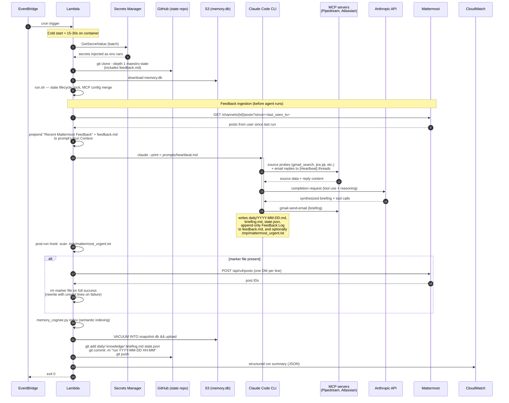

# Maestro Architecture (AWS Deployment)

This document describes the cloud-deployed shape of Maestro, planned for **Phase 4** (see [`ROADMAP.md`](ROADMAP.md)). The current laptop deployment uses the same agent code (`run.sh`, `lib/`, `prompts/`) but with Windows Task Scheduler instead of EventBridge, local files instead of S3 + git, and `.env` instead of Secrets Manager.

Two diagrams: a **topology view** (what lives where) and a **sequence view** (what happens during a single heartbeat invocation).

## Topology

```mermaid
flowchart LR
    subgraph USER["You"]
        Reply["Mattermost reply<br/>(in #MAESTRO)"]
        EmailReply["Email reply<br/>(to [Heartbeat] thread)"]
        FeedbackEdit["feedback.md edit<br/>(commit to maestro-state)"]
    end

    subgraph EXT["External services"]
        Pipedream["Pipedream MCP<br/>Gmail send + Drive<br/>(replaced in Phase 4.5<br/>by direct Google APIs)"]
        Atlassian["Atlassian MCP<br/>Jira + Confluence"]
        Mattermost["Mattermost<br/>(self-hosted instance)"]
        Anthropic["Anthropic API<br/>Claude Opus / Sonnet"]
    end

    subgraph GH["GitHub"]
        RepoHarness["repo: maestro<br/>harness code + Dockerfile<br/>+ terraform/"]
        RepoState["repo: maestro-state (private)<br/>daily/, knowledge/, briefing.md,<br/>state.json"]
        Actions["GitHub Actions<br/>build → ECR push → Lambda update"]
    end

    subgraph AWS["AWS (eu-north-1)"]
        EB["EventBridge Scheduler<br/>hourly heartbeat + daily EOD"]
        ECR["ECR<br/>maestro container image"]
        Lambda["Lambda (container, 2GB)<br/>15-min timeout<br/>1 concurrent invocation"]
        SM["Secrets Manager<br/>Anthropic key, Atlassian token,<br/>Mattermost bot token,<br/>GitHub state-repo PAT"]
        S3State["S3: maestro-state-bucket<br/>memory.db + run snapshots"]
        S3Fails["S3: maestro-state-bucket/failures/<br/>full Claude response on error"]
        CW["CloudWatch<br/>Logs + Alarms<br/>(duration, errors, missed runs)"]
    end

    EB -->|cron fires| Lambda
    ECR -->|image pull| Lambda
    Lambda -->|fetch on cold start| SM
    Lambda <-->|clone / push<br/>(state + feedback.md)| RepoState
    Lambda <-->|download / upload| S3State
    Lambda -->|on failure| S3Fails
    Lambda -->|stdout JSON lines| CW
    Lambda -->|MCP HTTPS| Pipedream
    Lambda -->|MCP HTTPS| Atlassian
    Lambda -->|POST /posts (urgent)<br/>GET /posts (feedback poll)| Mattermost
    Lambda -->|inference| Anthropic

    Reply -.->|user types reply| Mattermost
    EmailReply -.->|user replies| Pipedream
    FeedbackEdit -.->|user commits + push| RepoState

    RepoHarness -->|push main| Actions
    Actions -->|docker build| ECR
    Actions -->|update-function-code| Lambda

    classDef aws fill:#fff5e6,stroke:#d97706,color:#000
    classDef github fill:#f0f0f0,stroke:#555,color:#000
    classDef ext fill:#e8f3ff,stroke:#1d4ed8,color:#000
    classDef user fill:#f0fdf4,stroke:#16a34a,color:#000
    class AWS,EB,ECR,Lambda,SM,S3State,S3Fails,CW aws
    class GH,RepoHarness,RepoState,Actions github
    class EXT,Pipedream,Atlassian,Mattermost,Anthropic ext
    class USER,Reply,EmailReply,FeedbackEdit user
```

### Why these choices

- **Lambda (container)** instead of EC2/Fargate: simplest scheduling story with EventBridge; no idle compute cost; reproducible image. 15-min timeout is the known cliff — EOD currently runs ~13.4 min so we have ~90s of headroom. If EOD grows past 14 min consistently, we'll split it via Step Functions (`gather` + `synthesize+send`).
- **Container image** (not zip): the runtime needs Claude Code CLI + Python + jq + bash; zip lambda's 50-MB limit doesn't fit. Multi-stage Dockerfile keeps cold-start under 30s.
- **Hybrid state — git for markdown, S3 for memory.db**: the markdown state (`daily/`, `knowledge/`, `briefing.md`, `state.json`) is human-readable and benefits from version history — `git diff` literally shows you what Maestro learned in the last run. `memory.db` is an 8-MB SQLite-vec binary fully rewritten on every run; in git it would bloat history within weeks. S3 (with versioning enabled) gives the same rollback property without git pain.
- **Secrets Manager** instead of `.env` files in S3: env-file-in-S3 is a leak waiting to happen (S3 misconfig, IAM mistake, accidental public bucket). Secrets Manager has audit logs and rotation hooks.
- **CloudWatch + S3 failure capture**: structured JSON logs in CloudWatch handle infra failures (Lambda errored, took too long, missed a run). But LLM agents fail differently — they often exit 0 while doing the wrong thing. The S3 `failures/<timestamp>/response.txt` artifact captures Claude's full response on every error so you can replay the prompt locally to debug.

### Two-repo separation

The harness repo (`maestro`) and the state repo (`maestro-state`) are deliberately split:

| | `maestro` | `maestro-state` |
|---|---|---|
| Contents | `run.sh`, `lib/`, `prompts/`, `CLAUDE.md`, `config.example.json`, `Dockerfile`, `terraform/` | `daily/`, `knowledge/`, `briefing.md`, `state.json`, optionally `feedback.md` |
| Public-eligible? | Yes (Phase 5 template) | No, ever |
| Change cadence | Weekly (code changes) | Hourly (agent writes) |
| Diff value | Code review | Agent's learning audit trail |

In the laptop deployment, both directories are colocated (one folder). In cloud, they're separate clones — harness comes from the image build, state is pulled at run start.

## How the agent learns from you

Maestro consumes four kinds of input from you. The first three are **explicit feedback** — you wrote something with the intent of being read. The fourth is **implicit** — Maestro observes your behavior and updates its model of you without you saying anything. Today, implicit observation is doing most of the learning work; the explicit channels exist for moments when implicit isn't enough.

| Channel | Best for | Latency | Friction |
|---|---|---|---|
| **Mattermost reply** (in #MAESTRO) | In-the-moment correction or context drop ("I'm OOO tomorrow") | Picked up at next heartbeat (≤ 1h) | Lowest — just type at the bot |
| **Email reply** (to a `[Heartbeat]` thread) | Per-briefing reaction ("acted on the PROJ-123 thread; ignoring the newsletter") | Next heartbeat | Low — already in inbox |
| **`feedback.md` edit** (commit to maestro-state repo) | Persistent structural preferences ("always ignore newsletters from X") | Next heartbeat after git pull | Higher — explicit dev workflow |
| **Implicit behavioral observation** | Patterns you don't think to articulate (work hours, response style, deferral habits) | Continuous | None — passive |

### What the agent does with each

- **Mattermost replies**: Lambda's heartbeat-start step fetches messages since `state.json > cached.last_seen_mattermost_message_ts` and prepends them as `## Recent Mattermost Feedback` in the prompt. The agent classifies each message (correction / preference / context-drop / acknowledgment) and acts on it during this run — including, where appropriate, appending a line to `feedback.md > Feedback Log` so there's a paper trail.
- **Email replies**: `prompts/heartbeat.md` step 1.1 already explicitly scans for `[Heartbeat]` thread replies and treats their content as feedback. Same classification + Feedback Log behavior.
- **`feedback.md`**: read at every run start, parsed by the agent for the structured sections (Ignored Topics, Always Include, Current Context, Preferences). The user-edited sections are sacrosanct — the agent never modifies them. The agent **may** append to a single `## Feedback Log` section, recording when it received feedback via Mattermost/email and what it interpreted the intent to be. This gives both sides a shared audit trail of the agent's understanding.
- **Behavioral observation**: every successful run rewrites parts of `knowledge/user-profile.md` based on what you did — Jira transitions, email sends, Confluence edits. Patterns gain confidence over multiple observations; entries that aren't reconfirmed in 14 days are marked for decay. This is the most powerful feedback channel and you don't have to do anything for it to work.

### Why all three explicit channels (not just one)

Different feedback shapes have different latency and structure needs. A single channel forces every feedback type through one shape:
- All-Mattermost: every message needs LLM classification on every read. Higher cost, more room for misinterpretation.
- All-`feedback.md`: highest friction. You won't actually do it for one-off corrections.
- All-email: dead until Phase 4.5 fixes Pipedream.

Three channels with pre-classified intent (Mattermost = "look at this now", email = "respond to this briefing", feedback.md = "structural preference") let each channel be optimized for its job. The cost is more wiring; the benefit is that the friction matches the importance.

## Sequence: single heartbeat invocation



### What happens on failure

- **Lambda timeout (15 min)**: EventBridge auto-marks the invocation failed. CloudWatch alarm fires. Next hour's invocation runs fresh; state repo's last successful commit is the last successful run — no half-written state goes upstream.
- **Claude API error or rate limit**: `run.sh` retries once with backoff (30s for heartbeat, 60s for EOD). If both fail, exit non-zero; CloudWatch alarm on error count > 0.
- **MCP source down** (e.g., Pipedream Gmail outage like the one observed 2026-04-24 → 2026-05-08+): `lib/state.py` capability-gating logic disables the source after a threshold of consecutive failures, agent gets a "Disabled Sources" block injected in its next prompt, agent emails the user once on the healthy→degraded→disabled transition.
- **`mattermost.py send-file` partial failure**: the marker file is rewritten with the still-unsent lines and the run exits non-zero. The next hour's heartbeat picks up the retry; the email-with-the-same-content already shipped.
- **`git push` of state repo fails** (network blip, conflict): run exits non-zero. State is lost in Lambda's `/tmp` on next cold start. CloudWatch alarm catches it. Acceptable risk: one run's worth of daily-log appends, less than a paragraph of content.
- **S3 `memory.db` upload fails**: memory index regression to the previous snapshot on next run. Indexing is idempotent; no data loss beyond the unsent run's deltas.

## Roughly: cost

Estimated monthly cost at 60 invocations/week (hourly Mon–Fri 08–20):

| Component | Estimate | Notes |
|---|---|---|
| Lambda compute | $0.50–$2 | 60 × 5min × 2GB at $0.0000166667/GB-s |
| ECR storage | $0.10 | One image, ~1.5 GB |
| S3 (state + memory.db) | $0.10 | < 1 GB total at $0.023/GB |
| CloudWatch Logs | $0.50–$2 | ~10 MB/day ingest at $0.50/GB |
| Secrets Manager | $1.20 | 3 secrets × $0.40/secret/month |
| EventBridge Scheduler | $0 | First 14M invocations free |
| Anthropic API | $30–$100+ | **Dominant cost.** Opus heartbeats are token-heavy. |
| **Total** | **$32–$105/month** | Claude API is ~95% of the bill. |

The "boring" alternative (t4g.nano EC2 + crontab) would be ~$3/month for compute. Lambda's premium is for not having to babysit an instance.

## What's NOT in this diagram

- **Two-way Mattermost**: inbound polling (or slash-command webhook → API Gateway → Lambda) is deferred. Once it lands, a second Lambda function handles slash commands; the main heartbeat Lambda doesn't need to change.
- **Direct Google APIs** (Phase 4.5): replaces Pipedream once gog/equivalent CLI or the Python SDK is wired in. Same Lambda, same image — just different MCP/HTTPS calls inside `lib/`.
- **Open-source template** (Phase 5): repo split is already template-shaped; documentation and example values are the missing piece.
- **Multi-region / DR**: single-region for now. Maestro is personal and tolerates a few hours of downtime.

## See also

- [`ROADMAP.md`](ROADMAP.md) — phased plan including Phase 4 migration sequence
- [`CLAUDE.md`](CLAUDE.md) — agent identity, constraints, and write-surface rules
- [`README.md`](README.md) — laptop setup and modes
